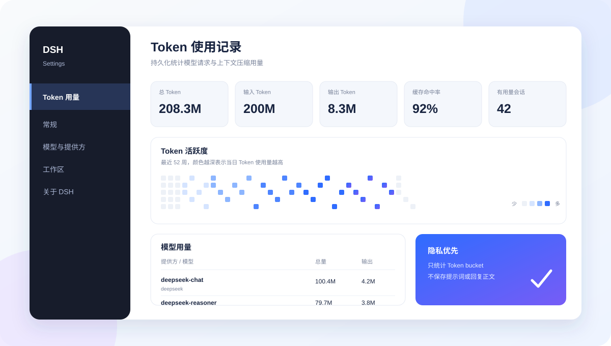
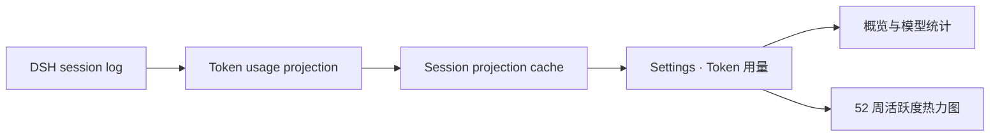

# dsh-token-usage

<p align="center">
  <a href="https://awesome-dsh-plugin.com"></a>
  <a href="LICENSE"></a>
  <a href="https://github.com/LeemanCheung/dsh-token-usage"></a>
</p>

<p align="center">
  面向 <a href="https://github.com/deepseek-ai/deepseek-harness">DeepSeek Harness</a> 的持久化 Token 用量记录插件：按模型、会话与日期统计，并在设置页提供紧凑的可视化仪表盘。
</p>

<p align="center">
  
</p>

> 上图为界面示意图。插件会从 DSH 的持久会话日志构建统计，不保存提示词或回复正文。

## ✨ 亮点

| 能力 | 说明 |
| --- | --- |
| **完整 Token bucket** | 分别记录未缓存输入、输出、缓存读取与缓存写入；`reasoningTokens` 已包含在输出中，不重复计算。 |
| **多维统计** | 以 provider / model、会话与 UTC 日期聚合普通对话、每次重试和上下文压缩用量。 |
| **52 周热力图** | GitHub commit graph 风格的 Token 活跃度图；颜色越深代表当天总用量越高，悬停可查看精确数值。 |
| **紧凑布局** | 使用 `K` / `M` / `B` 展示大数字，悬停显示完整数值；热力图自适应设置页宽度，默认无需横向拖动。 |
| **历史预热** | 启动后顺序回放可读取的历史会话并写入 projection cache，不阻塞插件启动。 |
| **隐私优先** | 仅保留统计 bucket、日期和模型路由，不复制提示词、回复内容或其他会话正文。 |

## 🚀 安装

```powershell
dsh plugin --profile web add github:LeemanCheung/dsh-token-usage
```

安装后重启当前 `dsh web` 进程并刷新 [http://127.0.0.1:3080](http://127.0.0.1:3080)，再打开 **设置 → Token 用量**。

<details>
<summary>本地源码开发安装</summary>

在本目录的上一级运行：

```powershell
dsh plugin --profile web add ./dsh-token-usage
```

</details>

## 📊 仪表盘内容

- **概览卡片**：总 Token、输入 Token、输出 Token、缓存命中率和有用量会话数。
- **Token 活跃度**：最近 52 周按天汇总的热力图；每个方格提供“日期 · 精确 Token 数”的悬停说明。
- **模型用量**：按 provider / model 汇总调用次数、总量、输入与输出；缓存读写作为输入的辅助明细展示。
- **会话记录**：可搜索会话标题、会话 ID 或模型路由，并查看最近活动时间及用量分布。

### 统计口径

| 指标 | 计算方式 |
| --- | --- |
| 输入 Token | `uncachedInputTokens + cacheReadTokens + cacheWriteTokens` |
| 总 Token | 输入 Token + `outputTokens` |
| 缓存命中率 | `cacheReadTokens / 输入 Token` |
| 输出 Token | 使用 provider 上报的 `outputTokens`；不另加 `reasoningTokens` |

同一请求步骤若先后出现流式 usage 与最终消息 usage，最终值会替换该步骤的临时值，避免重复记账；发生 `llm/retry` 后，每个重试尝试仍会被独立统计。

## 🧭 数据流



- Host 侧监听普通模型请求、重试和上下文压缩事件，构建会话级持久 projection。
- 历史会话在后台按顺序预热；冷会话在恢复期间重新附着时，会重新写入最新 live checkpoint，避免回退缓存水位。
- Web 侧将所有会话 projection 聚合为仪表盘数据。较旧的内置 projection 会显示为“未归因用量”，以保持总量守恒。

## 🔄 更新与热加载

| 改动类型 | 如何生效 |
| --- | --- |
| Host 逻辑（projection、事件、统计） | 重启 `dsh web`，使 Node Host 重新加载插件。 |
| Client/UI（React、CSS） | 仅当同一 DSH checkout 正运行 `pnpm run dev:web` 监听器时，重建 bundle 后可通过 HMR 更新；否则重启并刷新。 |
| GitHub 源码更新 | 新安装会取得仓库当前默认分支的预构建 bundle；已运行的实例仍按上两行规则更新。 |

## 🛠️ 开发

本项目当前以 GitHub 源码插件形式分发，不发布到 npm。源码与 DSH checkout 并排放置，`tsdown.config.ts` 复用 DSH 的官方 Client bundle preset。

```powershell
npm test
npm run typecheck
npm run build
```

构建产物为 `lib/index.js` 与 `lib/client.js`，已提交到仓库，确保可直接通过 GitHub 安装。

## ⚠️ 已知限制

- 历史预热依赖 DSH session projection cache。预热完成前，仅有内置 projection 的旧会话会被显示为“未归因用量”；刷新后可读取新的模型明细。
- 单个损坏或不可读取的历史会话只会记录警告，不会阻止插件启动。
- 热力图按持久事件的 UTC 日期统计；旧版内置 projection 缺少逐日数据时，会暂按会话最后活动日归档。

## 📄 License

[MIT](LICENSE) © LeemanCheung
