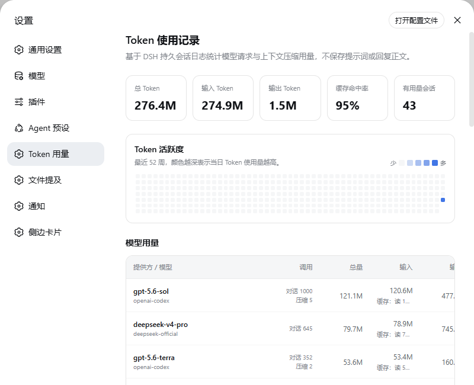
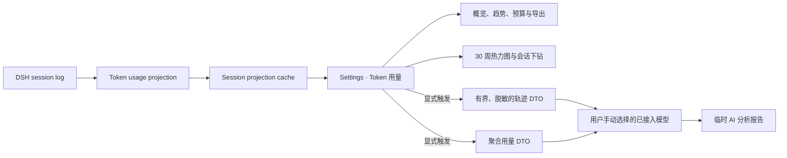

# dsh-token-usage

<p align="center">
  <a href="https://awesome.re"></a>
  <a href="https://awesome-dsh-plugin.com"></a>
  <a href="LICENSE"></a>
  <a href="https://github.com/LeemanCheung/dsh-token-usage"></a>
</p>

<p align="center">
  面向 <a href="https://github.com/deepseek-ai/deepseek-harness">DeepSeek Harness</a> 的 Token 可观测性插件：持久统计模型用量，并让用户手动选择已接入模型按需生成用量和会话轨迹分析。
</p>

<p align="center">
  
</p>

> 真实 DSH 设置页截图。截图仅展示聚合 Token 统计与模型路由，不包含会话标题、提示词或回复正文。

## 🗺️ 功能概览

<p align="center">
  
</p>

## ✨ 亮点

| 能力 | 说明 |
| --- | --- |
| **完整 Token bucket** | 分别记录未缓存输入、输出、缓存读取与缓存写入；`reasoningTokens` 已包含在输出中，不重复计算。 |
| **多维统计** | 以 provider / model、会话与 UTC 日期聚合普通对话、每次重试和上下文压缩用量。 |
| **30 周热力图** | GitHub commit graph 风格的 Token 活跃度图；颜色越深代表当天总用量越高，悬停查看明细，点击下钻到贡献会话。 |
| **周期、预算与导出** | 比较 7/30/90 日趋势，设置本地持久化的滚动 30 日预算，并导出聚合 JSON、每日 CSV 或模型 CSV。 |
| **AI 用量优化** | 手动选择任一已接入的 provider/model，对总量、输入/输出/缓存、路由贡献、趋势和波动生成证据化分析与 P0/P1/P2 优化建议。 |
| **轨迹智能分析** | 手动选择会话后，使用同一手动选择的已接入模型审查调用链、委派、合规性、异常恢复、速率、性能、可靠性和 Token 效率。 |
| **确定性证据** | 用量报告只依据聚合 bucket、路由、次数和 UTC 日期；轨迹报告同时获得事件/分钟、Token/分钟、回合、步骤、工具错误、重试、压缩、审批与子代理等本地计算指标。 |
| **紧凑布局** | 使用 `K` / `M` / `B` 展示大数字，悬停显示完整数值；热力图自适应设置页宽度，默认无需横向拖动。 |
| **历史预热** | 启动后顺序回放可读取的历史会话并写入 projection cache，不阻塞插件启动。 |
| **隐私优先** | 持久层只保存统计数据；轨迹分析显式触发、长度受限、脱敏常见凭据，报告仅在当前页面内存中展示。 |

## 🚀 安装

```powershell
dsh plugin --profile web add github:LeemanCheung/dsh-token-usage
```

安装后重启当前 `dsh web` 进程并刷新 [http://127.0.0.1:3080](http://127.0.0.1:3080)，再打开 **设置 → Token 用量**。

<details>
<summary>本地源码开发安装</summary>

在本目录的上一级运行：

```powershell
dsh plugin --profile web add ./dsh-token-usage
```

</details>

## 📊 仪表盘内容

- **概览卡片**：总 Token、输入 Token、输出 Token、缓存命中率和有用量会话数。
- **周期趋势**：切换 7/30/90 日窗口，查看当前周期总量、环比、活跃天数与峰值日。
- **30 日预算**：预算写入本机 DSH settings；显示滚动消耗比例与超额提示，填 0 或清空可关闭。
- **AI Token 用量分析**：从已接入模型中手动选择一个模型，按需生成总量、输入/输出/缓存、路由集中度、趋势、峰值、波动和优化建议报告。
- **Token 活跃度**：最近 30 周按天汇总的热力图；悬停方格查看缓存等明细，点击查看当天贡献会话。
- **模型用量**：按 provider / model 汇总调用次数、总量、输入与输出；缓存读写作为输入的辅助明细展示。
- **聚合导出**：导出不含会话标题和正文的版本化 JSON、每日 CSV 或模型 CSV；CSV 单元格防公式注入。
- **会话记录**：搜索会话标题、会话 ID 或模型路由，并可从任一有用量会话启动轨迹智能分析。

### 统计口径

| 指标 | 计算方式 |
| --- | --- |
| 输入 Token | `uncachedInputTokens + cacheReadTokens + cacheWriteTokens` |
| 总 Token | 输入 Token + `outputTokens` |
| 缓存命中率 | `cacheReadTokens / 输入 Token` |
| 输出 Token | 使用 provider 上报的 `outputTokens`；不另加 `reasoningTokens` |

同一请求步骤若先后出现流式 usage 与最终消息 usage，最终值会替换该步骤的临时值，避免重复记账；发生 `llm/retry` 后，每个重试尝试仍会被独立统计。

## 🤖 AI Token 用量分析

在仪表盘的 **AI Token 用量分析** 卡片中，从已注册且能列出模型的 provider/model 路由里手动选择一个模型，再点击 **生成用量分析**。选择会同时用于下面的会话轨迹分析，但每次分析仍需单独手动触发。

报告固定覆盖：

| 分析面 | 依据与输出 |
| --- | --- |
| 总量与结构 | 未缓存输入、输出、缓存读取和缓存写入的占比与变化。 |
| 路由贡献 | 按 provider/model 的 Token、对话次数和压缩次数识别集中度与高消耗路由。 |
| 时间趋势 | UTC 日粒度的活跃度、峰值与波动；长历史最多取最新 366 天进入模型证据。 |
| 风险与不确定性 | 明确区分统计事实和推测；没有价格、延迟、质量或会话内容时不会虚构成本或因果。 |
| 优化建议 | 3–7 条带 P0/P1/P2、证据、预期 Token 效率收益、置信度和实施工作量的建议。 |

### 聚合数据、隐私与费用

- 用量分析只发送总 Token bucket、provider/model 路由、对话/压缩次数和 UTC 每日 bucket；不会发送会话 ID、标题、提示词、回复、工具参数或其他会话正文。
- 模型证据最多保留 Token 最大的 48 条路由记录与最新 366 条日期记录；总量仍来自完整仪表盘聚合。
- 报告和辅助调用用量仅驻留当前页面内存，刷新后消失，不进入会话日志、projection cache 或任何导出文件。
- 用户选择的 provider/model 会实际产生一次辅助模型调用；报告卡会显示该调用的 provider/model 与 Token 用量。用量分析最多生成 2,600 Token。
- 目录只显示已接入且当前可列出模型的路由。模型目录或调用失败时，页面会显示错误，不会悄悄改用默认模型。

## 🧠 会话轨迹智能分析

在 **会话记录** 中点击 **分析轨迹**。Host 会读取 live 会话的当前完整事件日志，或通过 `sessionPersistence.inspect()` 读取冷会话，不依赖浏览器仅加载的分页窗口；随后使用 AI Token 用量分析卡片中手动选择的已接入 provider/model，并以一次 registration-bound prepared LLM call 生成报告。

报告覆盖以下方面：

| 分析面 | 关注内容 |
| --- | --- |
| 调用链与委派 | Turn → Step → 模型 → Tool → Result、子代理/工作流委派关系及主要瓶颈。 |
| 合规与安全 | 审批结果、权限/沙箱变化、敏感信息暴露迹象、破坏性动作与用户意图的一致性。 |
| 异常与恢复 | 模型重试、重复调用、循环、工具错误、中断回合、压缩失败、停滞及后续恢复。 |
| 速率与性能 | 事件/分钟、Token/分钟、调用突发、阶段耗时、并发和可能的等待热点。 |
| Token 与上下文效率 | 输入/输出/缓存分布、压缩压力、上下文增长、模型切换与潜在浪费。 |
| 工具与子代理成效 | 工具成功率、错误聚类、委派收益、重复工作与汇总质量。 |
| 可靠性与生命周期 | Turn/Step 配对、Tool call/result 配对、完成原因和未闭合操作。 |
| 优先级建议 | 基于事件序号与确定性指标给出 P0/P1/P2 改进项及预期收益。 |

### 输入、隐私与费用

- 分析由用户显式触发，报告不写入会话日志、projection cache 或导出文件；刷新页面后不会保留。
- 原始 `assistant/chunk` 不进入分析请求，只计入省略数量；其他事件会递归限制深度、集合大小与单条长度。
- 模型输入最多约 96,000 字符；超限时保留轨迹首尾并插入截断标记，UI 会提示模型未看到完整中段。
- 发送前会尽力遮蔽 Bearer Token、`sk-*` 以及常见 API key、password、secret、credential 字段，但这不是完整 DLP。请按所配置模型提供方的数据政策评估敏感会话。
- 模型最多生成 3,000 Token；本次辅助调用的 provider/model 和 Token 用量会显示在报告卡片中，但不会计入持久化用量 projection。
- 该私有 RPC 只允许本机 loopback Web 页面调用；必须先在 DSH 中接入可列出模型的 provider/model，并由用户手动选择；不会隐藏地回退到默认模型。

## 🧭 数据流



- Host 侧监听普通模型请求、重试和上下文压缩事件，构建会话级持久 projection。
- 历史会话在后台按顺序预热；冷会话在恢复期间重新附着时，会重新写入最新 live checkpoint，避免回退缓存水位。
- Web 侧将所有会话 projection 聚合为仪表盘数据。较旧的内置 projection 会显示为“未归因用量”，以保持总量守恒。
- 两类 AI 分析都走独立的 loopback 私有 RPC，并只接受用户从已接入模型目录中选择的路由：用量分析只传聚合 DTO；轨迹分析由 Host 读取权威事件日志、构造有界脱敏 DTO。Web 只接收 JSON 指标和 Markdown 报告。

## 🔄 更新与热加载

| 改动类型 | 如何生效 |
| --- | --- |
| Host 逻辑（projection、事件、统计） | 重启 `dsh web`，使 Node Host 重新加载插件。 |
| Client/UI（React、CSS） | 仅当同一 DSH checkout 正运行 `pnpm run dev:web` 监听器时，重建 bundle 后可通过 HMR 更新；否则重启并刷新。 |
| GitHub 源码更新 | 新安装会取得仓库当前默认分支的预构建 bundle；已运行的实例仍按上两行规则更新。 |

## 🛠️ 开发

本项目当前以 GitHub 源码插件形式分发，不发布到 npm。源码与 DSH checkout 并排放置，`tsdown.config.ts` 复用 DSH 的官方 Client bundle preset。

```powershell
npm test
npm run typecheck
npm run build
```

构建产物为 `lib/index.js` 与 `lib/client.js`，已提交到仓库，确保可直接通过 GitHub 安装。

## ⚠️ 已知限制

- 历史预热依赖 DSH session projection cache。预热完成前，仅有内置 projection 的旧会话会被显示为“未归因用量”；刷新后可读取新的模型明细。
- 单个损坏或不可读取的历史会话只会记录警告，不会阻止插件启动。
- 热力图按持久事件的 UTC 日期统计；旧版内置 projection 缺少逐日数据时，会暂按会话最后活动日归档。
- 轨迹报告是模型辅助审查，不是策略执行器或合规证明；确定性指标与事件序号优先于模型推断。
- 常见凭据脱敏是尽力而为，不替代组织级 DLP；超长轨迹的中段会被明确截断。
- AI 用量报告和轨迹报告当前不持久化、不支持历史对比；分析调用的 Token 只显示在当次报告中，不计入持久化仪表盘。
- AI 用量分析只可选择当前能由已接入 provider 列出的模型；每日趋势证据最多传递最新 366 天，模型建议不替代价格、延迟或质量观测。

## 📄 License

[MIT](LICENSE) © LeemanCheung
